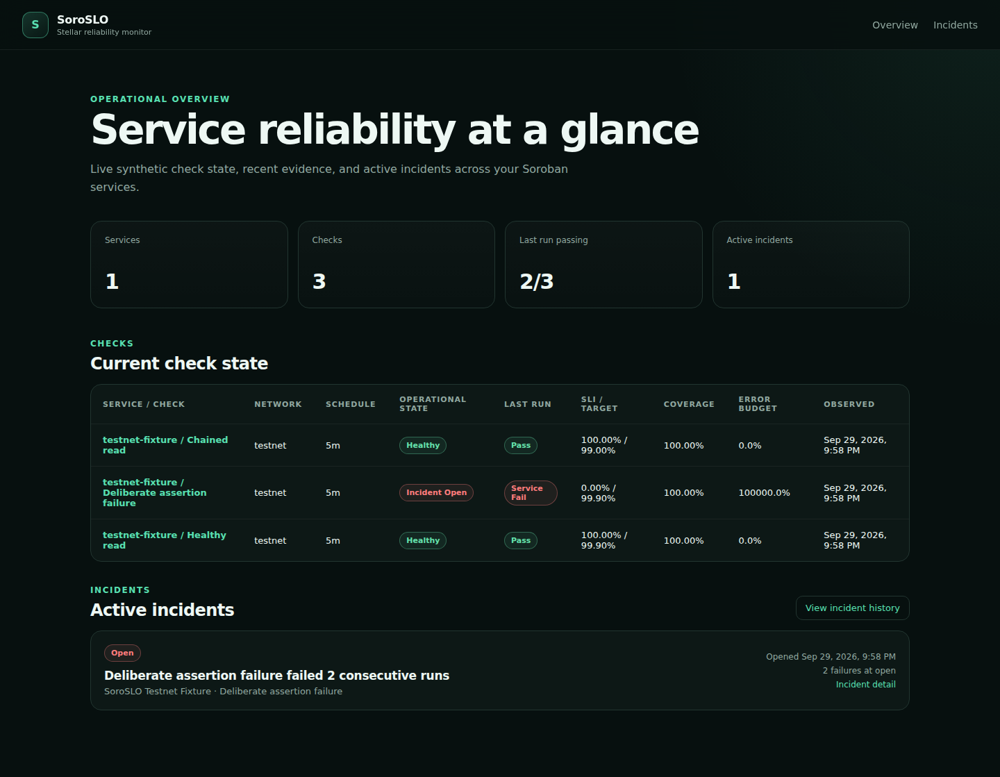

# SoroSLO

**Synthetic service-level monitoring for Stellar/Soroban applications.**

SoroSLO is an open-source, self-hosted reliability monitor that runs read-only Soroban simulations against deployed contracts, evaluates deterministic application-level assertions, stores durable evidence, and calculates rolling SLI/SLO and error-budget state.

> Is the service built from my deployed Soroban contracts actually behaving correctly against its declared reliability target?



## v0.1.0 release candidate

The v0.1 implementation is complete through **M6** and has passed real Stellar Testnet acceptance. The release is published automatically only after this release candidate is merged and the verified `main` CI run succeeds.

Verified Testnet evidence:

- contract: `CBXNPLHGKIKF22QUEFWJFL6C7RY7HMWHMZHXQ5L2M2VXMVMOLL3TKPZW`
- live acceptance: healthy read `pass`
- chained read `pass`
- false assertion `service_fail`
- deterministic contract error `service_fail`
- unreachable RPC `observer_error`
- SoroSLO runtime signing key: **none**
- SoroSLO transaction submission: **none**

See [Testnet acceptance evidence](docs/testnet-acceptance.md).

## Core principles

- **Simulation-only.** Runtime checks use Stellar RPC `simulateTransaction`; SoroSLO does not sign or submit transactions.
- **No custody.** No Stellar secret seed, mnemonic, private signing key, or wallet session is required.
- **Deterministic assertions.** No `eval`, arbitrary JavaScript, shell hooks, or untrusted plugins.
- **Evidence-first.** Results are tied to configuration, observed ledger, RPC endpoint fingerprint, step evidence, and assertion evidence.
- **Run-based SLOs.** Periodic samples are not presented as exact wall-clock uptime.
- **Observer honesty.** RPC/tool failures are `observer_error`, not service failures.
- **Local-first.** SQLite and self-hosted deployment are the v0.1 baseline.
- **Focused scope.** TTL remediation, full event indexing, deployment management, source verification, and protocol compatibility are separate concerns.

## Runtime flow

```text
soroslo.yml
    │
    ▼
strict configuration validation
    │
    ▼
scheduled synthetic check
    │
    ├── simulate Soroban call
    ├── normalize result
    ├── evaluate assertions
    └── persist evidence
    │
    ▼
pass / service_fail / observer_error
    │
    ▼
rolling SLI + SLO + error budget
    │
    ├── dashboard / API
    └── incident + signed webhook
```

## Quick start

Prerequisites:

- Node.js 22+
- Corepack / pnpm 10.x
- Docker + Compose for the self-hosted stack

Development verification:

```bash
corepack enable
pnpm install
pnpm verify
pnpm test:e2e
```

Self-hosting:

```bash
cp .env.example .env
# create soroslo.yml and set a long SOROSLO_ADMIN_TOKEN in .env
docker compose up --build -d
```

The default published interfaces remain loopback-only.

## Configuration example

```yaml
version: 1

runtime:
  timezone: UTC
  dataDir: ./.soroslo
  defaultTimeout: 15s

networks:
  testnet:
    preset: testnet

services:
  - id: payments
    name: Payments
    checks:
      - id: quote-health
        name: Quote health
        network: testnet
        every: 5m
        slo:
          target: 99.9
          window: 7d
          minEligibleRuns: 20
          maxObserverErrorRate: 5
        steps:
          - id: quote
            contract: ${STELLAR_CONTRACT_ID}
            function: latest_quote
            args: []
            assertions:
              - path: $.value
                op: gt
                value: "0"
```

See [configuration](docs/configuration.md) and the runnable [examples](examples/).

## Documentation

- [v0.1 technical specification](docs/technical-spec-v0.1.md)
- [configuration reference](docs/configuration.md)
- [HTTP API](docs/api.md)
- [SLI/SLO semantics](docs/slo-semantics.md)
- [operations and Docker deployment](docs/operations.md)
- [threat model](docs/threat-model.md)
- [security boundaries](docs/architecture/security-boundaries.md)
- [real Testnet acceptance evidence](docs/testnet-acceptance.md)
- [v0.1.0 release notes](docs/releases/v0.1.0.md)

## Repository layout

```text
apps/
  api/          HTTP API and manual-run entrypoint
  dashboard/    Next.js operator UI
  runner/       restart-safe scheduler and execution daemon
packages/
  config/       strict versioned configuration
  stellar/      RPC, network identity, simulation, normalization
  probe-engine/ ordered check execution and result references
  assertions/   deterministic assertion engine
  slo-engine/   SLI/SLO/error-budget and incident state
  storage/      SQLite migrations and persistence
  alerts/       signed webhook delivery and deduplication
  shared/       shared domain utilities
cli/            operator CLI package boundary
contracts/      Testnet acceptance fixture
examples/       example configurations
```

## Milestones

- **M0 — Foundation** ✅
- **M1 — Stellar probe core** ✅
- **M2 — Check engine** ✅
- **M3 — Persistence & reliability** ✅
- **M4 — Product surfaces** ✅
- **M5 — Notifications & hardening** ✅
- **M6 — Ecosystem evidence / release readiness** ✅

## Contributing

See [CONTRIBUTING.md](CONTRIBUTING.md). The public backlog contains scoped contributor tasks with acceptance criteria, tests, dependencies, non-goals, and security notes.

## Security

SoroSLO runtime must never accept or persist Stellar secret seeds, mnemonic phrases, private signing keys, or wallet sessions. See [SECURITY.md](SECURITY.md).

## License

Apache License 2.0. See [LICENSE](LICENSE).
